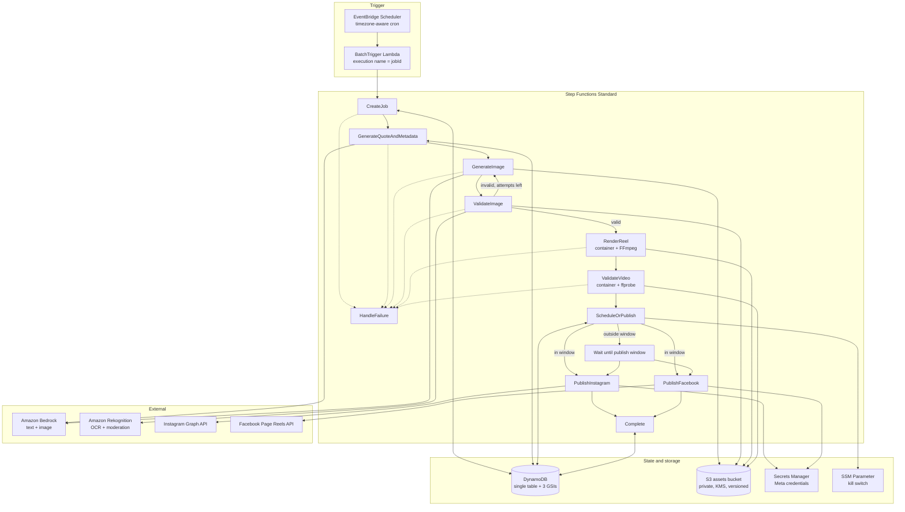
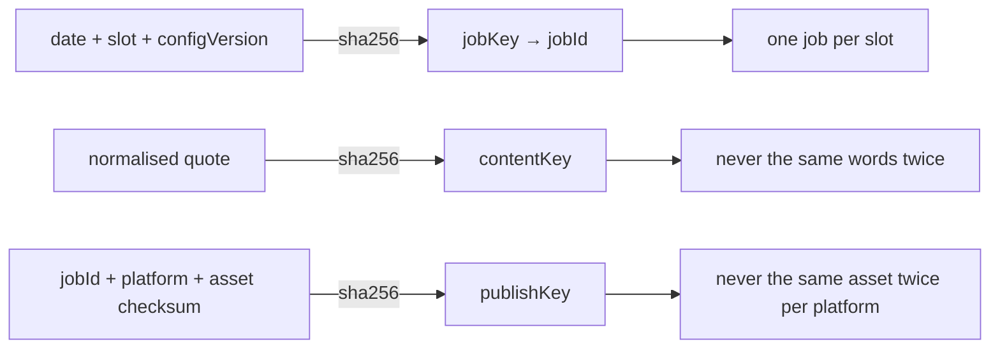
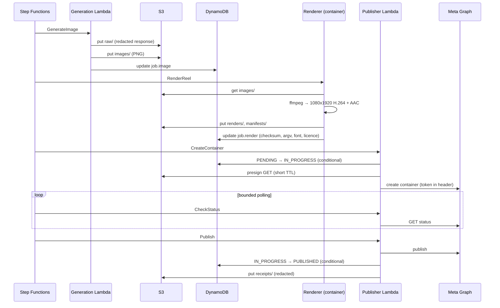

# Architecture

## Services and data flow

## Why these choices

**Step Functions Standard, not Express.** A job legitimately sits idle for hours
waiting for a posting window. Standard gives durable waits measured in hours, a
full execution history for audit, and per-state retry policies. Express would
force a polling loop and lose the history.

**Wait, not poll.** When a render finishes outside a posting window, the
execution parks in a `Wait` state with `TimestampPath: $.scheduledFor`. No
Lambda runs, nothing is billed, and there is no dispatcher to go wrong.

**Explicit publish phases.** Container creation, status polling and publication
are three separate states per platform, so each has its own retry policy,
timeout and metrics, and a failure is attributable to a phase.

**Parallel, not sequential, publishing.** Instagram and Facebook are separate
transactions with separate state rows. Each branch catches its own errors, so
one platform failing never fails the other or the job.

## State machine

| State | Function | Retries | On failure |
|---|---|---|---|
| `CreateJob` | orchestration | `RetryableError` ×3, full jitter | → `HandleFailure` |
| `GenerateQuoteAndMetadata` | generation | ×3 | → `HandleFailure` |
| `GenerateImage` | generation | ×3 | → `HandleFailure` |
| `ValidateImage` | generation | ×3 | loop to `GenerateImage`, else `HandleFailure` |
| `RenderReel` | renderer (container) | ×3, 12 min timeout | → `HandleFailure` |
| `ValidateVideo` | renderer (container) | ×3, 6 min timeout | → `HandleFailure` |
| `ScheduleOrPublish` | publisher | ×3 | → `HandleFailure` |
| `Publish*` (×3 states, ×2 platforms) | publisher | ×3 | → branch failure handler |
| `Complete` | orchestration | ×3 | → `HandleFailure` |

### Retry ownership

Deliberately split, and never nested:

- **Step Functions** owns task-level retries. It retries `RetryableError`,
  `Lambda.ServiceException` and `Lambda.TooManyRequestsException` with
  exponential backoff and **full jitter**, so concurrent retries against the same
  model or Graph endpoint decorrelate.
- **Handlers** retry only tight in-process calls — a single Graph GET inside
  `GraphClient` — with at most 3 attempts. They never retry a whole task.

### Bounded loops

There are exactly two loops, and both terminate by construction:

1. **Image regeneration.** `ValidateImage` returns `imageValid: false` and an
   incremented attempt counter. At `MAX_GENERATION_ATTEMPTS` it throws
   `ManualReviewRequiredError` instead of returning, so the Choice cannot loop
   again.
2. **Container polling.** `Wait` → `CheckStatus` → Choice. `checkPublishStatus`
   throws once `MAX_CONTAINER_POLL_ATTEMPTS` is reached.

An `EXPIRED` container routes back to container creation rather than retrying a
dead ID — but the publish-attempt counter is persisted, so that path is bounded
by `MAX_PUBLISH_ATTEMPTS` too.

## Idempotency

Three keys, each guarding a different side effect.

Duplicate delivery is stopped at four layers, in order:

1. **Step Functions execution name** is the deterministic `jobId`, so a repeated
   EventBridge delivery is rejected by Step Functions itself, before any Lambda
   runs.
2. **`CreateJob`** acquires the idempotency record with a conditional write. A
   completed record short-circuits the whole workflow and returns the stored
   result.
3. **Publish state rows** are created with `attribute_not_exists(pk)`, and every
   transition is conditional on the current status. A second `PENDING →
   IN_PROGRESS` fails, so a duplicate execution cannot create a second container.
4. **`PUBLISHED` is terminal.** `createPublishContainer` returns
   `already_published` without contacting Meta.

## Failure modes and recovery

| Failure | Detection | Behaviour | Recovery |
|---|---|---|---|
| Model throttled | `ThrottlingException` → `RetryableError` | SFN retries with jitter | Automatic |
| Model not enabled in region | `AccessDenied`/`ValidationException` → `ConfigurationError` | No retry, alarms | Fix `BEDROCK_*_MODEL_ID`, re-run |
| Quote fails content rules | Deterministic validator | Regenerate, bounded | Automatic; then manual review |
| Quote duplicates history | Conditional write on fingerprint | Regenerate, bounded | Automatic |
| Image wrong size / blank / text in reserved area | `ValidateImage` | Regenerate, bounded | Automatic; then manual review |
| FFmpeg fails | Non-zero exit | `RetryableError`, SFN retries | Automatic; then `FAILED` + alarm |
| FFmpeg build lacks `drawtext` | Pre-flight capability check | `ConfigurationError` before any work | Fix the build |
| Rendered file fails `ffprobe` | `ValidateVideo` | **Terminal.** Never reaches publish | Investigate, retry job |
| Instagram quota exhausted | `content_publishing_limit` before container creation | Publish state → `RETRYABLE` | Next window |
| Container `EXPIRED` | Status poll | Reset to a safe state, create a fresh container | Automatic, bounded |
| Container `ERROR` | Status poll | `RetryableError` | SFN retries; then review |
| Invalid/expired token | Graph code 190 → `ConfigurationError` | No retry, alarms | Rotate token (see operations) |
| Published but state write lost | Conditional transition fails after a successful publish | `ManualReviewRequiredError` | **Human decides** — the post may be live |
| Daily cap reached | Atomic counter | Platform skipped | Next day |
| Cost budget exceeded | Conditional counter | `GuardTrippedError`, job `CANCELLED` | Raise budget or wait |
| Kill switch engaged | SSM read | No new work, assets retained | Set parameter to `false` |
| SSM unreadable | Read throws | **Fails safe: treated as engaged** | Fix IAM/SSM |

### The one thing that cannot be undone

Once Meta accepts a publish, this system cannot roll it back. Deletion is a
manual action in the Meta tooling. Every guard in the pipeline exists because
that step is irreversible — see [`operations.md`](operations.md).

## Data flow for one asset

## Concurrency and cost control

| Control | Where | Default |
|---|---|---|
| Image generation concurrency | Lambda reserved concurrency | 4 |
| Render concurrency | Lambda reserved concurrency | 3 |
| Publish concurrency | Lambda reserved concurrency | 2 per phase |
| Daily publishes per platform | Atomic DynamoDB counter | 5 |
| Daily spend guard | Conditional DynamoDB counter | $5 |
| Monthly spend guard | Conditional DynamoDB counter | $100 |
| Kill switch | SSM parameter | disengaged |

Scaling from 5/day to 30/day means raising `DAILY_TARGET`,
`MAX_DAILY_PUBLISHES_PER_PLATFORM` and the budgets, plus confirming Instagram's
own publishing quota can absorb it. No architectural change is required — but
re-read [`decisions.md`](decisions.md) for the render-platform threshold.
